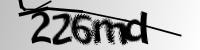
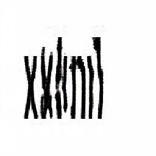
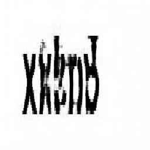
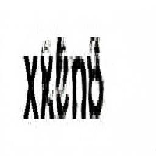
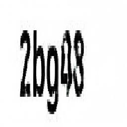

# RetoDotCSV2080Super
#RetoDotCSV2080Super #Scenio

RetoDotCSV2080Super - Captchas Solver
=====================================

¿Puede el algoritmo Pix2Pis resolver Google Captchas? ¿Es una amenaza para la seguridad ;-) ? En el estudio realizado resolvemos esta questión.

Dataset
-------

El dataset de partida se puede descargar de Kaggle en el siguiente enlace:

https://www.kaggle.com/fournierp/captcha-version-2-images

El cual contiene imágenes CAPTCHA (Completely Automated Public Turing test to tell Computers and Humans Apart). Construido en 1997 para discrimiar entre usuarios reales y bots, fue remplazado puesto que era vulnerable a algoritmos de inteligencia artificial.

Aunque existen formas distintas de abordar el problema (OpenCV con algoritmos basados en NNets) utilizaremos este juego de datos para validar si Pix2Pix tambíen puede realizar la tarea.

El dataset contiene únicamente imágenes de partida y el nombre de archivo es el contenido del Captcha.

Modificaciones al dataset:
+ El dataset está formado por 1073 imágenes en formato (png y jpg). Se ha descargado en la carpeta [data/samples](data/samples) y realizado una conversión de todas las imágenes a jpg con la utilidad: `mogrify -format jpg *.png`

+ Las imagenes están en formato escala de grises, por tanto 1 byte para cada pixel. Las librerías de tensorflow y el algoritmo Pix2Pix  esperan 3 bytes para cada pixel. Se ha desarrollado una pequeña utilidad para convertir a RGB las imágenes [convertRGB.py](data\convertRGB.py):

Las imágenes convertidas que se utilizarán para el entrenamiento, están ubicadas en el directorio [data/samplesRGB](data/samplesRGB)

Estrategia
----------

Pix2Pix requiere dos imágenes para funcionar, por tanto, el primer reto a resolver es la generación de imágenes destino para cada imagen origen.

Para ello, se ha generado un pequeño programa en python que genera imágenes destino:
+ Con el mismo tamaño que las imágenes de entrada
+ Utilizando una fuente similar a la utilizada por Google (Arial). Debe estar instalada en el equipo y el programa hace referencia a la misma en la carpeta de fuentes.
+ Ubicando el captcha resuelto en la misma zona de la imagen de las imágenes de prueba.

El programa se encuentra en el siguiente enlace: [generateTarget.py](data/generateTarget.py)

Las imágenes objetivo se encuentran en la carpeta [data/target](data/target).

Por ejemplo, para la imagen anterior 226md, se ha generado la siguiente imagen objetivo, aquella que deseamos obtener con el algoritmo Pix2Pix:

Ejecución
---------

La simulación se ha realizado a partir del código del capítulo de DOTCSV con una clara explicación del algoritmo y los fuentes originales del artículo: [Generando flores realistas con IA](www.youtube.com%2Fwatch%3Fv%3DYsrMGcgfETY&usg=AOvVaw2EhzgOGfuTM_-L4TGhGbBj)

La dificultad principal ha sido ejecutar el código en Google Research Collab, puesto que la instancia no tenía suficiente memoria para ejecutar el entrenamiento sobre el total del dataset disponible. Tras varias pruebas, se ha conseguido ejecutar con un tamaño del dataset del 20% (215 imágenes) sin tener problemas de rendimiento. En el código tambien se ha forzado entre epochs a Python a realizar limpieza de memoria. 

En el subdirectorio [data/output](data/output) se pueden encontrar el resultado de dos simulaciones ejecutadas durante 20 y 100 epochs respectivamente.

| Imagen Original | Imagen Objetivo | Imagen 25 epoch | Imagen 50 epoch | Imagen 75 epoch | Imagen 100 epoch |
| --------------- | --------------- | --------------- | --------------- | --------------- | ---------------- |
|  |  |  |  |  |  |
|  |  |  |  |  |  |
|  |  |  |  |  |  |
|  |  |  |  |  |  |

